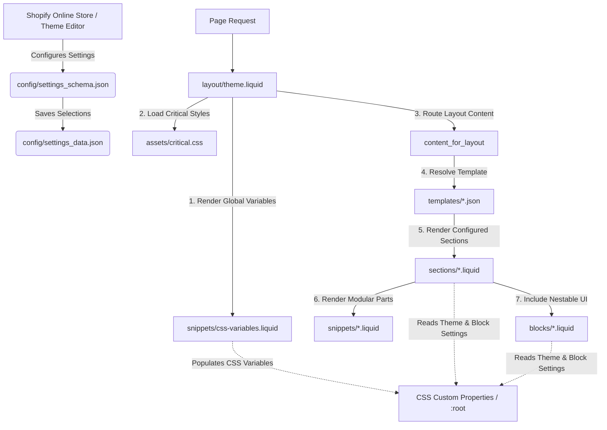

# Agent & Developer Guide: Shopify Skeleton & Avemos Theme

Welcome! This document provides a comprehensive technical blueprint of the Shopify Skeleton / Avemos Theme codebase, detailing its theme architecture, styling guidelines, schema conventions, and templates. Use this as a reference when editing features, adding sections/blocks, or styling components.

---

## 🏛️ Theme Architecture Overview

Shopify themes are built around modular, customizable components. Below is the system flow mapping how layouts, templates, sections, snippets, and settings schemas interact:



---

## 📁 Theme Directory Structure

```
shopify/
├── assets/             # Static theme assets (images, videos, styles, scripts)
│   ├── critical.css    # Critical CSS injected early in layout to prevent layout shifts
│   ├── avemos-style.css# Main custom stylesheet for styling sections/pages
│   └── avemos-script.js# General theme script for UI interactions and event handlers
├── blocks/             # Reusable and nestable liquid template blocks
├── config/             # Theme settings and defaults configuration
│   ├── settings_schema.json # Declares input fields for the Shopify Theme Editor
│   └── settings_data.json   # Auto-generated merchant settings configuration
├── layout/             # Top-level theme wrappers
│   ├── theme.liquid    # Main wrapper for page templates (header, cart-drawer, footer)
│   └── password.liquid # Password/landing page wrapper
├── locales/            # Theme translation and localization JSONs
├── sections/           # Modular page sections (e.g. avemos-reviews, cart, contact-us)
├── snippets/           # Reusable helper liquid components (e.g. css-variables, meta-tags)
├── templates/          # JSON-based page templates defining section structures
└── README.md           # Getting started and basic CLI usage guidelines
```

---

## 🎨 Global Styling System & CSS Variables

Our styling system leverages CSS custom variables to ensure consistency and modularity. Avoid using inline styles or adding hardcoded hex colors/pixels. 

### 1. CSS Variables (`snippets/css-variables.liquid`)
All theme editor selections are translated into CSS custom variables inside the `:root` scope:
*   `--font-primary--family`: Font family based on `settings.type_primary_font`
*   `--page-width`: Max page width setting (`settings.max_page_width`)
*   `--page-margin`: Padding margin setting (`settings.min_page_margin`)
*   `--color-background`: Global background color (`settings.background_color`)
*   `--color-foreground`: Global foreground text color (`settings.foreground_color`)
*   `--style-border-radius-inputs`: Border radius for forms and inputs (`settings.input_corner_radius`)

### 2. Stylesheet Separation
*   **Critical Styles (`assets/critical.css`)**: Contains essential styles for above-the-fold layout structure, reset styles, and loading animations. Placed in `theme.liquid` header with `preload: true`.
*   **Theme/Custom Styles (`assets/avemos-style.css`)**: Contains specific classes for the custom pages, reviews, header/footer, comparison tables, FAQ lists, and other Shopify sections.
*   **Section-Specific Styles**: Use Liquid `` blocks inside section liquid files for styling that is isolated to that specific module.

---

## ⚙️ Settings Schema & Customization Guidelines

When developing section or block schemas, follow Shopify's guidelines to simplify styling:

### Single CSS Property Settings
For settings corresponding to a single CSS property, inject the value inline via a CSS variable style attribute:
```liquid
<div class="custom-card" style="--gap: {{ section.settings.gap }}px">
  ...
</div>


  .custom-card {
    gap: var(--gap);
  }

```

### Multiple CSS Property Settings
For settings controlling multiple CSS properties, define option values as classes:
```liquid
<div class="custom-card {{ section.settings.layout }}">
  ...
</div>


  .custom-card--full-width {
    width: 100%;
    padding: 0;
  }
  .custom-card--narrow {
    max-width: 60rem;
    padding: 10px;
  }

```

---

## 💡 Developer Cheatsheet

### Core CLI Commands
Use the Shopify CLI to run, preview, and manage your theme:
```bash
# Start local theme development server
shopify theme dev

# Push local development changes to a specific theme ID or role
shopify theme push

# Pull remote theme changes from your shopify online store
shopify theme pull

# Run theme check linting to find syntax errors and best practice violations
shopify theme check
```

### Adding a New Section
1.  Create a new file in `sections/` (e.g. `sections/custom-banner.liquid`).
2.  Structure the markup and add a `` tag outlining settings and presets:
    ```liquid
    <section class="custom-banner">
      <h2>{{ section.settings.title }}</h2>
    </section>

    
    {
      "name": "Custom Banner",
      "settings": [
        {
          "type": "text",
          "id": "title",
          "label": "Heading",
          "default": "Hello World"
        }
      ],
      "presets": [
        {
          "name": "Custom Banner"
        }
      ]
    }
    
    ```
3.  Add it to your page template (e.g. `templates/index.json`) under the `sections` dictionary.

---

## 🧭 Component Navigation & Mapping Guide

To make changes to specific theme components, use the file mapping below:

### 1. Header & Navigation Menu
*   **Main Section**: [sections/avemos-header.liquid](sections/avemos-header.liquid) - sets announcement bar, logo selection, heights, margins, and header menus.
*   **Inner Markup**: [snippets/avemos-header-markup.liquid](snippets/avemos-header-markup.liquid) - houses the HTML layout for the logo, navigation links, and shopping cart badge.
*   **Styling**: Look for `.header`, `.announcement-bar`, and `.header-nav` classes in [assets/avemos-style.css](assets/avemos-style.css).

### 2. Cart & Cart Drawer
*   **Slide-out Cart Drawer**: [sections/cart-drawer.liquid](sections/cart-drawer.liquid) - handles checkout summaries, product lines, quantities, and drawer animations.
*   **Main Cart Page**: [sections/cart.liquid](sections/cart.liquid) - redirect fallback wrapper for Cart Drawer.
*   **Javascript Actions**: [assets/avemos-cart-drawer.js](assets/avemos-cart-drawer.js) controls drawer state, fetch API sync, quantity changes, and shipping protection.

### 3. Policy & Static Pages
Avemos policy templates use the reusable [sections/policy-page.liquid](sections/policy-page.liquid) wrapper which dynamically renders raw HTML/rich-text. The policy texts are loaded from:
*   **Shipping Policy**: [snippets/shipping-policy-content.liquid](snippets/shipping-policy-content.liquid) (template: `page.shipping-policy.json`)
*   **Refund Policy**: [snippets/refund-policy-content.liquid](snippets/refund-policy-content.liquid) (template: `page.refund-policy.json`)
*   **Terms of Service**: [snippets/terms-of-service-content.liquid](snippets/terms-of-service-content.liquid) (template: `page.terms-of-service.json`)
*   **User Agreement**: [snippets/user-agreement-content.liquid](snippets/user-agreement-content.liquid) (template: `page.user-agreement.json`)
